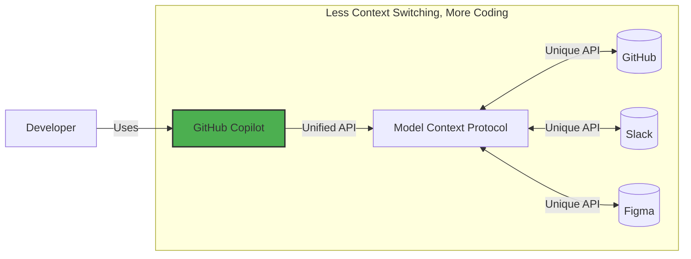

## Step 1: MCPの紹介と環境セットアップ


[Getting Started with GitHub Copilot](https://github.com/skills/getting-started-with-github-copilot) 演習では、Mergington High Schoolの課外活動ウェブサイトを紹介しました。このサイトでは生徒がイベントに申し込むことができます

そして今、私たちは問題に直面していますが…良い問題です！より多くの先生がこのサイトを使いたいと希望しています 🎉

先生たちからたくさんのアイデアが寄せられていますが、すべてのリクエストに対応しきれていません 😮 この課題を解決するために、GitHub CopilotをアップグレードしてModel Context Protocol（MCP）を有効化しましょう。具体的には、GitHub MCPサーバーを追加し、課題管理とウェブサイトのアップグレードを組み合わせたワークフローを実現します 🧑‍🚀

さっそく始めましょう！

### Model Context Protocol（MCP）とは？

[Model Context Protocol (MCP)](https://modelcontextprotocol.io/introduction) は「AIのためのUSB-C」とも呼ばれています。GitHub Copilot（や他のAIツール）が他のサービスとシームレスに連携できるユニバーサルコネクタです

本質的には、サービスの機能や要件を記述する方法であり、AIツールがどのメソッドを使うべきか、どんなパラメータを渡すべきかを簡単に判断できるようにします。MCPサーバーがそのインターフェースを提供します



### :keyboard: アクティビティ: 環境を確認しましょう

MCPに進む前に、開発環境を起動し、課外活動アプリケーションを再確認しましょう

1. 下のボタンを右クリックして **Create Codespace** ページを新しいタブで開いてください。デフォルト設定のまま使ってください

   [](https://codespaces.new/{{full_repo_name}}?quickstart=1)

1. **Copilot Chat** と **Python** 拡張機能がインストールされ有効になっていることを確認してください

   <br/>
   

1. アプリケーションが修正前に動作することを確認してください。左サイドバーで **Run and Debug** タブを選択し、**Start Debugging** アイコンを押してください

   <details>
   <summary>📸 スクリーンショットを表示</summary><br/>

   

   </details>

   <details>
   <summary>🤷 トラブルシューティング</summary><br/>

   **Run and Debug** エリアが空の場合は、VS Codeをリロードしてみてください。コマンドパレット（`Ctrl`+`Shift`+`P`）を開き、`Developer: Reload Window` を検索してください

   

   </details>

1. **Ports** タブでウェブページのアドレスを探し、開いて動作を確認してください

   <details>
   <summary>📸 スクリーンショットを表示</summary><br/>

   

   

   </details>

### :keyboard: アクティビティ: GitHub MCPサーバーを追加しましょう

1. Codespace内で **Copilot Chat** パネルを開き、**Agent** モードが選択されていることを確認してください

   

   <details>
   <summary>Agentモードが見つからない場合</summary><br/>

   - VS Codeが `v1.99.0` 以上であることを確認してください
   - Copilot拡張機能が `v1.296.0` 以上であることを確認してください
   - [ユーザーまたはワークスペース設定](https://code.visualstudio.com/docs/configure/settings#_workspace-settings)でAgentモードが有効になっているか確認してください

      

   </details>

1. Codespace内で `.vscode` フォルダに移動し、新しいファイル `mcp.json` を作成してください。以下の内容を貼り付けてください

   📄 **.vscode/mcp.json**

   ```json
   {
     "servers": {
       "github": {
         "type": "http",
         "url": "https://api.githubcopilot.com/mcp/"
       }
     }
   }
   ```

1. `.vscode/mcp.json` ファイル内で **Start** ボタンをクリックし、GitHubで認証するプロンプトを承認してください。これでGitHub CopilotにMCPサーバーの機能が通知されました

   

   <br/>

   

1. Copilotサイドパネルで **🛠️ アイコン** をクリックし、追加機能を表示してください

   

   

1. `.vscode/mcp.json` ファイルを **コミット** し、`main` ブランチに **プッシュ** してください

   > 🪧 **注意:** `main` へ直接プッシュするのは推奨される運用ではありません。この演習を簡単にするためだけです

1. MCPサーバーの設定をGitHubにプッシュしたので、Monaが作業をチェックし始めているはずです。コメント欄で進捗情報や次のレッスンを確認してください

> [!NOTE]
> 次のステップではGitHub Issueの作成が含まれます。通知メールを避けたい場合は、リポジトリのウォッチを解除してください

<details>
<summary>トラブルシューティング</summary><br/>

以下を確認してください

- `.vscode/mcp.json` ファイルが例と同じ内容になっていること
- 変更を `main` ブランチにプッシュしたこと

</details>
